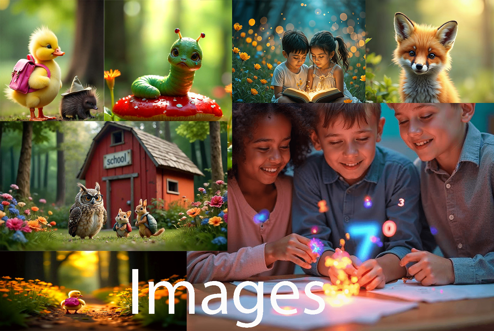

  

This project challenged me in ways I hadn't anticipated. Learning JavaScript has been akin to acquiring a new language, requiring both time and perseverance. While I believe the time allocated to this subject was somewhat limited, I hope the final result reflects the effort invested.

My brother, a teacher, has often highlighted one of the major issues facing today’s younger generation: comprehension. The question, "Do you understand what you just read?" is one that frequently arises in the classroom. With this in mind, I sought to create an engaging story filled with dynamic characters, an approach designed to enhance reading comprehension while simultaneously improving vocabulary skills.

The website offers quick quiz to test comprhension and some fun with a flip game. It was planned in this manner, firstly to reduce the quantity of information that needs to be worked through and secondly to keep the readers attention. The scope of what the site can become is large and many extra efatures can be loaded in the future.

I really hope you enjoy the site, not only for the visually appealing elements, but also the wonderful characters it brings to life.

## Table of Contents

1.  

        
<a href="#user-design">User Design</a>

        <ul>
        <li>

        
<a href="#goals">Goals</a>

        - [Visitor Goals](#visitor-goals)
        - [Business Goals](#business-goals)
        
</li>

        <li>

        
<a href="#visual-design">Visual Design</a>

        - [Wireframes](#wireframes)
        - [Fonts](#fonts)
        - [Icons](#icons)
        - [Colors](#colors)
        - [Images](#images)
        
</li>
        </ul>

    

1.  

        
<a href="#features">Features</a>

        <ul>
        <li>

        
<a href="#page-elements">Page Elements</a>

        - [Index Page](#index-page)
        - [Lola Page](#lola-page)
        - [Bubbles Page](#lola-page)
        - [404 Page](#404-page)
        - [Contact Page](#contact-page)
        
</li>

        <li>

        
<a href="#additional-features">Additional Features</a>

        - [Multiple choice questionare](#multiple-choice-questionare)
        - [Contact Form](#contact-form)
        - [Flip card game](#flip-card-game)
        
</li>

    

2.  

        
<a href="#technologies-used">Technologies Used</a>

        - [Languages](#languages)
        - [Frameworks](#frameworks)
        - [Libraries](#libraries)
        - [APIs](#apis)
        - [Platforms](#platforms)
        - [Other Tools](#other-tools)

    

3.  

        
<a href="#testing">Testing</a>

        <ul>
        <li>

        
<a href="#methods">Methods</a>

        - [Validation](#validation)
        - [General Testing](#general-testing)
        - [Mobile Testing](#mobile-testing)
        - [Desktop Testing](#desktop-testing)
        
</li>

        <li>

        
<a href="#bugs">Bugs</a>

        - [Known Bugs and fixes](#known-bugs-and-fixes)
        
</li>
        </ul>

    

4.  

        
<a href="#deployment">Deployment</a>

        <ul>
        <li>

        
<a href="#local-deployment">Local Deployment</a>

        - [Local Preparation](#local-preparation)
        
</li>

        <li>

        
<a href="#github-deployment">Github Deployment</a>

        - [Instructions](#instructions)
        
</li>
        </ul>

    

5.  

        
<a href="#credit-and-contact">Credit and Contact</a>

        - [Content](#content)
        - [Contact](#contact)

    

---

# UX

## Goals

### Visitor Goals

- The website is built for young children and their parents to practice their reading skills and reading comprehension.
- A card flip game is addeed to the secon story to give the children a break from learning.

### Business Goals

- The end goal would be to create a rounded portfolio of educational products for all age groups.
- Possible expansion to online lerrning and sections for collaborators and educators to offer their services.

## Visual Design

### Wireframes

  

- Wireframes were created on [Balsamiq](https://balsamiq.com/)
- Initially the site was just meant to be a one page scroller, that evolved into a multipage site.
- The site contains 5 pages
  - Homepage
  - English reading - Lola
  - English reading - Bubbles
  - Contact page
  - 404 page

### Fonts

  

- "Poppins" is easy to read.
- "Courgette" offers a bit of playfulness while maintaining readability.

### Icons

  

- The icons are all arranged in a footer section and link to the respective website.

### Colors

  

- As this site is dedicated to education, I chose the colors accordingly.
  - #f5b705 (Yellow): Yellow is often associated with positivity, energy, and happiness. It encourages creativity and optimism, which are essential for a learning environment.
  - #589dd9 (Blue): Blue represents trust, calmness, and reliability. These traits are important for an educational website to foster confidence and comfort among users.
    Blue is known to improve focus and encourage a sense of stability, which can help users engage more deeply with the content.
  - #3f9004 (Green): Green symbolizes growth, learning, and harmony, which are directly connected to the goals of education.
  - #d99007 (Orange): Orange combines the energy of yellow and the stability of red, often representing enthusiasm and determination. It can be used to motivate users and
    create a sense of excitement about learning.

### Images

  

- Images were all created using AI in [Freepik](https://de.freepik.com).
- The mood of the website is whimsical and I wanted the imagery to reflect that.
- AI was used as my story is original and I was unable to find the images that fit.

---

# Features

### Page Elements

#### Index Page

  

- This page offers a beautiful introduction, with a small about section.
- Two links lead the user to the respective reading pages.
- The header offers two more links, to the Home page and to the contact page.
- A small logo is also placed in the left top corner that links to the homepage.

#### Lola Page

  

- The story of little Lolas way to school is broken up into sections.
- Each section contains a image, text and a small MCQ (js funcionality).
- At the end of the page, we find a bit of fun with a confetti button (js funcionality).
- A button is place at the end of the page above the footer, to return the user to the top (js funcionality).

#### Bublles Page

  

- The story of Bubbles containes a flip card game and is broken up into sections.
- Each section contains a image and text.
- A button is place at the end of the page above the footer, to return the user to the top (js funcionality).

#### 404 Page

  

- The page contains a hero image and a message.
- A linked is placed that opens the homepage.
-

#### Contact Page

  

- The page contains a hero image and a contact form.
- Clicking the send button opens the 404 page.

#### Navbar

  

#### Footer

  

---

# Technologies Used

## Languages

- [HTML](w3.org/standards/webdesign/htmlcss)
  - Page markup.
- [CSS](w3.org/standards/webdesign/htmlcss)
  - Styling.
- [Javascript](https://developer.mozilla.org/en-US/docs/Web/JavaScript)
  - Running functions for interactive components, AJAX, etc.

## Frameworks

- [Bootstrap5](https://getbootstrap.com/)
  - Used for basic styles and outline.

## Libraries

- [Google Fonts](https://fonts.google.com)
  - Font Styles.
- [Fontawesome](https://fontawesome.com/)
  - Used for icons
- [npm](https://cdn.jsdelivr.net/npm/js-confetti@latest/dist/js-confetti.browser.js)
  - Used for confetti

## Platforms

- [Github](https://github.com/)
  - Storing code remotely and deployment.
- [Gitpod](https://gitpod.io/)
  - IDE for project development.

## Other Tools

- [Balsamiq](https://balsamiq.com/)
  - To create wireframes.
- [Favicon Generator](https://www.favicon-generator.org/)
  - Favicons

---

# Testing

## Methods

### Validation

- HTML has been validated with [W3C HTML5 Validator](https://validator.w3.org/).
  

  

  

  

  

  

- CSS has been validated with [W3C CSS Validator](https://jigsaw.w3.org/css-validator/).
 
 

  

- Each javascript file was tested on the site for errors and functionality using the console and with [JSHint](https://jshint.com/).

### General Testing

- I have sent the deplyment link to various friend and family, especially ones with children to test usability and UI.
- The site has been validated and put through the W3Validator and [Google Lighthouse]

### Mobile Testing

- I have sent the deplyment link to various friend and family, especially ones with children to test usability and UI.

### Desktop Testing

## Bugs

### Known Bugs and fixes
- Initially I wanted to add a crossword puzzle for the page, but the scope was way too big and time consuming to add. 
- I had a major problem with javascript coding affecting other elements.
  - I created a javascript page dedicated to each page.

----

# Github Deployment

### Instructions

- Log into [Github](https://github.com/LanaD-cell)
- In "Popular repositories" click on oh-no-lola.
- On the right side of the page, under "Deployments", click on github-pages.
- A new page will open,(https://github.com/LanaD-cell/oh-no-lola/deployments/github-pages).
- At the top of the page, there will be a link for the deployment site.
- The following link can be used to view the deployed site,[Github Deployment](https://lanad-cell.github.io/oh-no-lola/)
- When clicked, the website will open on a new page.

## Credits and Contact

### Content
- The MCQ was compiled from nuwerous different sources on [StackOverflow](https://stackoverflow.com/)
- Nearly all text content was generated by ChatGpt.
- I coded alongside [Coding Nepal Build A Memory Card Game in HTML CSS & JavaScript](https://www.youtube.com/watch?v=DABkhfsBAWw)
- All photographs were generated in [FREEPIK](https://de.freepik.com/search?icon_color=multicolor&format=search&type=icon&shape=fill)
- Logo design is my own.

### Contact

Please feel free to contact me at `c.wnt.nd1053gmail.com`
